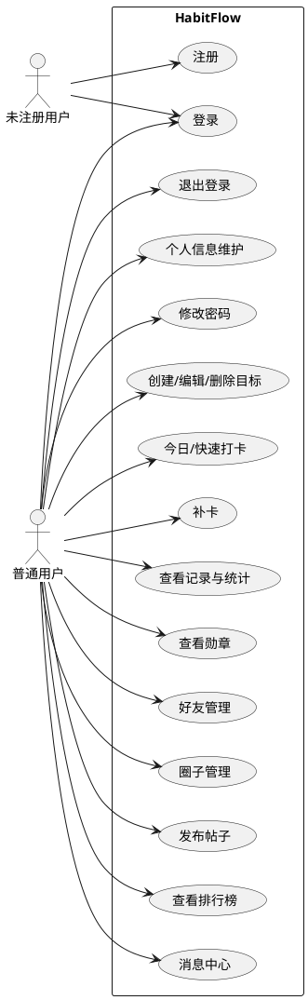

# HabitFlow 自律目标追踪平台 需求分析文档

> 文档版本：v1.0  
> 创建日期：2026-06-18  
> 对应选题：自律目标追踪平台

---

## 一、问题定义

### 1.1 项目名称

**HabitFlow 自律目标追踪平台**

### 1.2 项目背景

大学生和普通用户经常制定自律目标（如每天运动30分钟、每周读一本书、每天背单词），但在执行过程中面临以下问题：

- **缺乏有效的跟踪工具**：纸质记录容易丢失，Excel 不够直观
- **缺少激励机制**：独自坚持容易放弃，没有正向反馈
- **缺乏社交监督**：一人打卡缺少同伴监督氛围
- **数据反馈薄弱**：看不到自己的成长趋势和进步轨迹

### 1.3 解决方案

HabitFlow 构建一个集**个人目标管理、每日打卡、数据统计、勋章激励、好友社交、打卡圈子**于一体的 Web 平台，帮助用户养成自律习惯。系统分为两大部分：

- **个人自律模块**：围绕用户自己的目标、打卡、统计、奖励展开
- **社交互动模块**：围绕好友关系、兴趣圈子、圈内动态和共同打卡展开

### 1.4 项目定位

面向学生和普通用户的习惯养成与自律目标管理平台，兼具个人自律管理和社交监督机制。

---

## 二、用户角色

| 角色 | 描述 | 前置条件 |
|:---|:---|:---|
| **未注册用户** | 首次访问系统的访客，只能看到登录注册页面 | 无 |
| **普通用户** | 已完成注册登录的用户，可使用全部个人和社交功能 | 完成注册并登录 |

---

## 三、功能需求

### 3.1 用户与账号管理（已实现）

| 功能编号 | 功能名称 | 详细描述 | 优先级 |
|:---|:---|:---|---:|
| FR-1.1 | 用户注册 | 通过用户名、密码、邮箱注册；用户名唯一性校验；密码 bcrypt 加密存储；注册成功后自动登录并返回 JWT 令牌 | P0 |
| FR-1.2 | 用户登录 | 使用用户名和密码登录；身份验证通过后返回 JWT 令牌；前端保存令牌到 localStorage | P0 |
| FR-1.3 | 退出登录 | 清除前端登录令牌和缓存信息；返回登录页面 | P0 |
| FR-1.4 | 个人信息维护 | 查看个人资料（用户名、邮箱、注册时间）；修改用户名和邮箱；修改时校验用户名唯一性 | P1 |
| FR-1.5 | 修改密码 | 校验原密码正确性；设置新密码并加密保存；修改成功后提示用户 | P1 |

### 3.2 目标管理（已实现）

| 功能编号 | 功能名称 | 详细描述 | 优先级 |
|:---|:---|:---|---:|
| FR-2.1 | 创建目标 | 填写目标名称、类型（学习/运动/阅读/英语/早睡/健身）、开始日期、结束日期、周期（每日/每周/每月）、每日目标次数；校验结束日期不早于开始日期 | P0 |
| FR-2.2 | 编辑目标 | 修改目标的全部属性 | P1 |
| FR-2.3 | 删除目标 | 删除目标及其关联的打卡记录；带确认提示防止误删 | P1 |
| FR-2.4 | 目标状态管理 | 支持三种状态：进行中（ACTIVE）、已暂停（PAUSED）、已完成（DONE）；仅"进行中"状态允许打卡 | P1 |
| FR-2.5 | 完成率计算 | 公式：完成率 = 已打卡次数 / 应打卡次数 × 100%；按周期（日/周/月）计算应完成次数 | P1 |

### 3.3 打卡管理（已实现）

| 功能编号 | 功能名称 | 详细描述 | 优先级 |
|:---|:---|:---|---:|
| FR-3.1 | 今日打卡 | 选择进行中的目标→填写备注→提交；记录日期和时间；防止同一目标同一天重复打卡；打卡后自动刷新目标进度 | P0 |
| FR-3.2 | 快速打卡 | 在目标列表中直接点击打卡按钮完成一键打卡；自动生成"快速打卡"备注 | P1 |
| FR-3.3 | 补卡功能 | 选择目标→选择历史日期→填写原因；校验补卡日期必须早于今天；校验日期在目标周期内；防止重复补卡 | P1 |
| FR-3.4 | 打卡记录查看 | 展示打卡日期、所属目标、备注、打卡类型（正常打卡/补卡）、打卡时间 | P1 |
| FR-3.5 | 按目标筛选记录 | 按目标查看对应的打卡历史 | P2 |

### 3.4 数据统计（已实现）

| 功能编号 | 功能名称 | 详细描述 | 优先级 |
|:---|:---|:---|---:|
| FR-4.1 | 数据概览 | 展示目标总数、进行中目标数、总完成次数、当前连续打卡天数、平均完成率 | P0 |
| FR-4.2 | 月度成长报表 | 统计最近6个月的打卡次数；使用柱状图展示成长趋势 | P1 |
| FR-4.3 | 目标完成率图表 | 按目标统计完成率；使用折线图对比不同目标的执行情况 | P1 |
| FR-4.4 | 连续打卡统计 | 从当天向前连续检查打卡记录；按日期去重；遇断档日期停止计算 | P1 |

### 3.5 勋章奖励（已实现）

| 功能编号 | 功能名称 | 详细描述 | 优先级 |
|:---|:---|:---|---:|
| FR-5.1 | 勋章规则 | 内置5种勋章：初次打卡、连续7天、连续30天、百次打卡、自律达人 | P1 |
| FR-5.2 | 自动发放勋章 | 每次打卡或补卡后自动检查勋章条件；判断累计打卡次数和连续天数；防止重复发放 | P1 |
| FR-5.3 | 我的勋章 | 展示已获得的勋章；包括名称、描述、获得条件、获得时间 | P1 |

### 3.6 消息提醒（待实现）

| 功能编号 | 功能名称 | 详细描述 | 优先级 |
|:---|:---|:---|---:|
| FR-6.1 | 每日打卡提醒 | 定时检查当日未打卡目标；生成提醒消息；前端显示未读提醒数 | P2 |
| FR-6.2 | 目标到期提醒 | 检查目标结束日期；距结束较近时发送提醒 | P2 |
| FR-6.3 | 连续中断提醒 | 检测昨日是否缺卡；生成中断提醒消息 | P2 |
| FR-6.4 | 消息中心 | 查看消息列表；区分已读/未读；标记消息已读；删除消息 | P2 |

### 3.7 好友社交（待实现）

| 功能编号 | 功能名称 | 详细描述 | 优先级 |
|:---|:---|:---|---:|
| FR-7.1 | 用户搜索 | 按用户名关键词搜索用户；排除当前登录用户；展示用户基础信息 | P1 |
| FR-7.2 | 发送好友申请 | 选择目标用户→填写申请留言；防止添加自己；防止重复发送申请；防止重复添加已有好友 | P1 |
| FR-7.3 | 好友申请列表 | 展示申请人信息、申请留言、申请时间 | P1 |
| FR-7.4 | 接受好友申请 | 将好友关系状态改为已通过；双方进入好友列表；记录成为好友的时间 | P1 |
| FR-7.5 | 拒绝好友申请 | 将好友关系状态改为已拒绝；保留申请记录；后续可允许重新申请 | P1 |
| FR-7.6 | 好友列表 | 展示好友用户名、邮箱、成为好友时间 | P1 |
| FR-7.7 | 好友动态（拓展） | 查看好友今日是否打卡；好友打卡排行榜；给好友发送鼓励 | P3 |

### 3.8 打卡圈子（待实现）

| 功能编号 | 功能名称 | 详细描述 | 优先级 |
|:---|:---|:---|---:|
| FR-8.1 | 圈子列表 | 展示系统默认圈子（英语打卡圈、健身打卡圈、阅读打卡圈）；显示圈子名称、简介、图标、成员数量、是否已加入 | P1 |
| FR-8.2 | 创建圈子 | 填写圈子名称和简介；创建者自动成为圈主；圈子名称唯一校验 | P1 |
| FR-8.3 | 加入圈子 | 加入感兴趣的圈子；自动记录加入时间；圈子成员数增加 | P1 |
| FR-8.4 | 退出圈子 | 删除圈子成员关系；圈子成员数减少；圈主默认不能直接退出自己创建的圈子 | P1 |
| FR-8.5 | 我的圈子 | 查看已加入的圈子列表；快速进入圈子详情 | P1 |

### 3.9 圈子帖子（待实现）

| 功能编号 | 功能名称 | 详细描述 | 优先级 |
|:---|:---|:---|---:|
| FR-9.1 | 发布帖子 | 选择已加入的圈子→输入帖子内容→发布；记录发布用户和发布时间；未加入圈子不能发帖 | P1 |
| FR-9.2 | 圈子帖子列表 | 查看某个圈子内的帖子；展示发帖人、所属圈子、内容、发布时间 | P1 |
| FR-9.3 | 圈子动态流 | 汇总用户已加入的所有圈子的最新帖子；按发布时间倒序展示；形成类似社区动态的信息流 | P2 |
| FR-9.4 | 帖子互动（拓展） | 评论帖子、点赞帖子、删除自己的帖子 | P3 |

### 3.10 社交排行榜（待实现）

| 功能编号 | 功能名称 | 详细描述 | 优先级 |
|:---|:---|:---|---:|
| FR-10.1 | 好友排行榜 | 按今日是否打卡、本周/本月打卡次数、连续打卡天数、总打卡次数对好友进行排行 | P2 |
| FR-10.2 | 圈子排行榜 | 按圈子统计成员打卡数据；展示前几名活跃用户 | P2 |
| FR-10.3 | 目标类型排行榜 | 按目标类型（英语、健身、阅读等）生成排行榜 | P3 |

---

## 四、非功能需求

| 分类 | 需求描述 |
|:---|:---|
| **运行环境** | 后端：Python 3.13+ / FastAPI 框架 |
| | 前端：Vue 3 + Vite 5 + Element Plus |
| | 数据库：MySQL 8.0+（utf8mb4 字符集） |
| | 操作系统：Windows 10/11（开发环境），Linux（部署） |
| **图形操作界面要求** | 基于 Element Plus 组件库的响应式 UI |
| | 左侧侧边栏导航 + 右侧工作区的经典后台布局 |
| | 统一的配色方案（蓝色主色调 + 绿色辅助色） |
| | 数据可视化图表（ECharts 柱状图、折线图） |
| | 登录注册页与主界面分离，未登录不可访问内部功能 |
| **性能要求** | 接口响应时间 < 2 秒（正常网络条件下） |
| | 支持至少 100 个并发用户 |
| | 前端页面首屏加载时间 < 3 秒 |
| **安全要求** | 密码使用 bcrypt 算法加密存储 |
| | 用户登录使用 JWT 令牌认证，有效期 7 天 |
| | 后端所有接口（除注册登录外）需携带令牌访问 |
| | 接口校验数据归属，用户只能操作自己的数据 |
| | 配置 CORS 跨域保护 |
| **可靠性要求** | 统一接口返回格式：`{ code, message, data }` |
| | 统一异常处理，业务错误返回 400，系统错误返回 500 |
| | 参数校验异常统一拦截 |
| | 数据库使用事务保证数据一致性 |
| | 启动时自动创建数据表和初始化勋章数据 |
| **可维护性要求** | 前后端分离架构，各自独立部署 |
| | 后端采用 RESTful API 设计风格 |
| | FastAPI 自动生成 Swagger 接口文档（`/docs`） |
| | 前端代码模块化，API 层与视图层分离 |

---

## 五、系统约束条件

| 分类 | 约束说明 |
|:---|:---|
| **技术栈约束** | 后端必须使用 FastAPI + SQLAlchemy ORM |
| | 前端必须使用 Vue 3 + Element Plus |
| | 数据库必须使用 MySQL |
| | 图表必须使用 ECharts |
| **接口规范约束** | 所有接口路径以 `/api/` 开头 |
| | 统一响应格式：`{ "code": 200, "message": "success", "data": {...} }` |
| | 认证方式：`Authorization: Bearer <token>` |
| | 日期格式：`YYYY-MM-DD` |
| | 时间格式：`YYYY-MM-DDTHH:mm:ss` |
| **数据约束** | 目标结束日期不能早于开始日期 |
| | 同一目标同一天不能重复打卡 |
| | 补卡日期必须早于今天且在目标周期内 |
| | 用户名全局唯一 |
| **前端约束** | 未登录用户只能访问登录注册页 |
| | 登录后默认进入数据概览页 |
| | 侧边栏显示5个导航项：数据概览、目标管理、打卡记录、勋章奖励、个人信息 |

---

## 六、用例图（Use Case Diagram）

### 6.1 用例图说明

用例图用于展示系统边界、参与者（角色）和用例（功能）之间的关系。以下是 HabitFlow 的完整用例图描述：

**参与者：**
- 未注册用户——只能使用注册和登录功能
- 普通用户——可以使用系统全部功能

**主要用例分组：**
1. **账号管理**：注册、登录、退出、个人信息维护、修改密码
2. **目标管理**：创建、编辑、删除目标、管理状态、查看完成率
3. **打卡管理**：今日打卡、快速打卡、补卡、查看记录
4. **数据统计**：查看概览、月度报表、完成率图表
5. **勋章系统**：查看我的勋章（自动发放，无需手动操作）
6. **好友社交**：搜索用户、发送/处理好友申请、好友列表
7. **打卡圈子**：查看圈子、创建/加入/退出圈子、我的圈子
8. **圈子帖子**：发布帖子、查看帖子列表、查看动态流
9. **消息提醒**：查看消息、标记已读
10. **排行榜**：好友排行、圈子排行、目标类型排行

### 6.2 用例图制作方法

> **推荐工具**：ProcessOn 网页版（免费）、Draw.io（免费）、PlantUML（代码生成）

#### 方法一：使用 Draw.io 手动绘制

访问 https://app.diagrams.net/，选择"UML"分类下的用例图模板，按以下步骤绘制：

1. 拖入 Actor（小人图标）表示"未注册用户"和"普通用户"
2. 拖入 Use Case（椭圆）表示每个功能用例
3. 拖入 System Boundary（矩形框）表示系统边界
4. 用连线连接 Actor 和 Use Case

**绘制建议（按区域分批画，不要全部画在一张图上）：**

| 图号 | 内容 | 包含用例 |
|:---|:---|:---|
| 图1 | 账号与目标管理 | 注册、登录、退出、个人信息、修改密码、创建/编辑/删除目标 |
| 图2 | 打卡与统计 | 今日打卡、快速打卡、补卡、查看记录、数据概览 |
| 图3 | 勋章与消息 | 查看勋章、消息提醒、消息中心 |
| 图4 | 社交互动 | 用户搜索、好友申请/处理、好友列表、圈子、帖子、排行榜 |

#### 方法二：使用 PlantUML 代码自动生成

如果安装 VS Code 插件（搜索 `PlantUML`），可以使用以下代码生成：



---

## 七、泳道图（Swimlane Diagram）——核心业务流程

### 7.1 泳道图说明

泳道图展示业务流程在不同角色/系统之间的流转。以下是 HabitFlow 两个核心流程的描述。

#### 流程一：今日打卡流程

**涉及角色：** 用户（前端页面）→ 后端服务 → 数据库

```
用户操作：点击今日打卡按钮
    ↓
前端：发送 POST /api/check-ins 请求
    ↓
后端：验证 JWT 令牌 → 验证目标状态（需 ACTIVE）
    ↓
后端：检查当日是否已打卡 → 未重复则保存记录
    ↓
后端：检查勋章条件 → 满足条件则自动发放勋章
    ↓
后端：返回操作结果
    ↓
前端：刷新页面数据 → 显示成功提示
```

#### 流程二：好友申请流程

```
用户 A：搜索用户 B → 发送好友申请
    ↓
后端：校验是否已添加 → 校验是否已发送过申请
    ↓
后端：保存申请记录（状态 PENDING）
    ↓
用户 B：查看好友申请列表
    ↓
用户 B：选择接受或拒绝
    ↓
后端：更新申请状态（ACCEPTED / REJECTED）
    ↓
用户 A 和 B 的好友列表同步更新
```

### 7.2 泳道图制作方法

> **推荐工具**：ProcessOn、Draw.io、LucidChart

**在 Draw.io 中绘制泳道图的步骤：**

1. 搜索 "Swimlane" 或 "Lane" 模板
2. 创建水平泳道：用户（前端）、后端服务、数据库
3. 在每个泳道内放置流程步骤（矩形框）
4. 用箭头连接步骤，标注流转方向
5. 用菱形表示判断分支（如"令牌是否有效"）

---

## 八、ER 图（实体关系图）

### 8.1 数据库实体关系

系统涉及以下核心数据实体：

| 实体 | 说明 | 主要属性 |
|:---|:---|:---|
| **User** | 用户 | id, username, password, email, create_time |
| **Goal** | 目标 | id, user_id, name, type, start_date, end_date, cycle, daily_target_count, status |
| **CheckIn** | 打卡记录 | id, goal_id, user_id, check_date, check_time, remark, makeup |
| **Badge** | 勋章定义 | id, code, name, description, condition_text |
| **UserBadge** | 用户勋章 | id, user_id, badge_id, obtained_time |
| **Notification** | 消息提醒（待实现） | id, user_id, content, is_read, create_time |
| **Friendship** | 好友关系（待实现） | id, requester_id, addressee_id, status, create_time |
| **Circle** | 打卡圈子（待实现） | id, name, description, icon, owner_id, create_time |
| **CircleMember** | 圈子成员（待实现） | id, circle_id, user_id, join_time |
| **CirclePost** | 圈子帖子（待实现） | id, circle_id, user_id, content, create_time |

### 8.2 实体关系

```
User ──1:N──→ Goal          （一个用户有多个目标）
User ──1:N──→ CheckIn       （一个用户有多个打卡记录）
Goal ──1:N──→ CheckIn       （一个目标对应多个打卡记录）
User ──1:N──→ UserBadge     （一个用户拥有多个勋章）
Badge ──1:N──→ UserBadge    （一个勋章被多个用户获得）
User ──1:N──→ Notification  （一个用户有多条消息）
User ──1:N──→ Friendship    （一个用户发起/接收多个好友关系）
User ──1:N──→ CircleMember  （一个用户加入多个圈子）
Circle ──1:N──→ CircleMember（一个圈子有多个成员）
Circle ──1:N──→ CirclePost  （一个圈子有多条帖子）
User ──1:N──→ CirclePost    （一个用户发布多条帖子）
```

### 8.3 ER 图制作方法

> ER 图有多种制作方式，任选一种即可：

#### 方法一：Draw.io 手动绘制（推荐，最简单）

访问 https://app.diagrams.net/
1. 选择 "Entity Relation" 或 "ER" 模板
2. 拖入 Entity（矩形框）表示每个数据表
3. 在框内填写字段名和类型
4. 拖入 Relationship（菱形/连线）连接实体
5. 标注 1:N 关系

#### 方法二：MySQL Workbench 逆向工程

如果你已经在 MySQL 中创建了表，可以用 MySQL Workbench 自动生成 ER 图：

1. 打开 MySQL Workbench
2. 连接数据库 → Database → Reverse Engineer
3. 选择 habitflow 数据库
4. Workbench 自动生成完整的 ER 图
5. 导出为图片插入文档

#### 方法三：用 SQL 文件生成 ER 图

你可以用下面这个 SQL 文件在 **MySQL Workbench** 中反向生成 ER 图。方法是：先导入 SQL 建表，然后用 Reverse Engineer 自动生成。

不过要注意，SQL 文件本身**不能直接生成图片**，需要配合 MySQL Workbench 使用。

下面是一个完整的 `docs/habitflow_schema.sql` SQL 建表文件，你可以用它来生成 ER 图或直接建表：

```sql
-- HabitFlow 数据库建表脚本
-- 可在 MySQL Workbench 中执行后，使用 Reverse Engineer 生成 ER 图

CREATE DATABASE IF NOT EXISTS habitflow CHARACTER SET utf8mb4 COLLATE utf8mb4_unicode_ci;
USE habitflow;

-- 用户表
CREATE TABLE user (
    id BIGINT PRIMARY KEY AUTO_INCREMENT,
    username VARCHAR(50) NOT NULL UNIQUE,
    password VARCHAR(255) NOT NULL,
    email VARCHAR(120),
    create_time DATETIME NOT NULL
) ENGINE=InnoDB DEFAULT CHARSET=utf8mb4;

-- 目标表
CREATE TABLE goal (
    id BIGINT PRIMARY KEY AUTO_INCREMENT,
    user_id BIGINT NOT NULL,
    name VARCHAR(120) NOT NULL,
    type VARCHAR(50) NOT NULL,
    start_date DATE NOT NULL,
    end_date DATE NOT NULL,
    cycle VARCHAR(20) NOT NULL,
    daily_target_count INT NOT NULL DEFAULT 1,
    status VARCHAR(20) NOT NULL DEFAULT 'ACTIVE',
    create_time DATETIME NOT NULL,
    update_time DATETIME NOT NULL,
    FOREIGN KEY (user_id) REFERENCES user(id)
) ENGINE=InnoDB DEFAULT CHARSET=utf8mb4;

-- 打卡记录表
CREATE TABLE check_in (
    id BIGINT PRIMARY KEY AUTO_INCREMENT,
    goal_id BIGINT NOT NULL,
    user_id BIGINT NOT NULL,
    check_date DATE NOT NULL,
    check_time DATETIME NOT NULL,
    status VARCHAR(20) NOT NULL DEFAULT 'DONE',
    remark VARCHAR(500),
    makeup BOOLEAN NOT NULL DEFAULT FALSE,
    FOREIGN KEY (goal_id) REFERENCES goal(id),
    FOREIGN KEY (user_id) REFERENCES user(id)
) ENGINE=InnoDB DEFAULT CHARSET=utf8mb4;

-- 勋章定义表
CREATE TABLE badge (
    id BIGINT PRIMARY KEY AUTO_INCREMENT,
    code VARCHAR(50) NOT NULL UNIQUE,
    name VARCHAR(80) NOT NULL,
    description VARCHAR(255) NOT NULL,
    condition_text VARCHAR(255) NOT NULL
) ENGINE=InnoDB DEFAULT CHARSET=utf8mb4;

-- 用户勋章关联表
CREATE TABLE user_badge (
    id BIGINT PRIMARY KEY AUTO_INCREMENT,
    user_id BIGINT NOT NULL,
    badge_id BIGINT NOT NULL,
    obtained_time DATETIME NOT NULL,
    FOREIGN KEY (user_id) REFERENCES user(id),
    FOREIGN KEY (badge_id) REFERENCES badge(id)
) ENGINE=InnoDB DEFAULT CHARSET=utf8mb4;

-- 消息提醒表（待实现）
CREATE TABLE notification (
    id BIGINT PRIMARY KEY AUTO_INCREMENT,
    user_id BIGINT NOT NULL,
    content VARCHAR(500) NOT NULL,
    is_read BOOLEAN NOT NULL DEFAULT FALSE,
    create_time DATETIME NOT NULL,
    FOREIGN KEY (user_id) REFERENCES user(id)
) ENGINE=InnoDB DEFAULT CHARSET=utf8mb4;

-- 好友关系表（待实现）
CREATE TABLE friendship (
    id BIGINT PRIMARY KEY AUTO_INCREMENT,
    requester_id BIGINT NOT NULL,
    addressee_id BIGINT NOT NULL,
    status VARCHAR(20) NOT NULL DEFAULT 'PENDING',
    create_time DATETIME NOT NULL,
    FOREIGN KEY (requester_id) REFERENCES user(id),
    FOREIGN KEY (addressee_id) REFERENCES user(id)
) ENGINE=InnoDB DEFAULT CHARSET=utf8mb4;

-- 打卡圈子表（待实现）
CREATE TABLE social_circle (
    id BIGINT PRIMARY KEY AUTO_INCREMENT,
    name VARCHAR(80) NOT NULL UNIQUE,
    description VARCHAR(255),
    icon VARCHAR(100),
    owner_id BIGINT NOT NULL,
    create_time DATETIME NOT NULL,
    FOREIGN KEY (owner_id) REFERENCES user(id)
) ENGINE=InnoDB DEFAULT CHARSET=utf8mb4;

-- 圈子成员表（待实现）
CREATE TABLE circle_member (
    id BIGINT PRIMARY KEY AUTO_INCREMENT,
    circle_id BIGINT NOT NULL,
    user_id BIGINT NOT NULL,
    join_time DATETIME NOT NULL,
    FOREIGN KEY (circle_id) REFERENCES social_circle(id),
    FOREIGN KEY (user_id) REFERENCES user(id)
) ENGINE=InnoDB DEFAULT CHARSET=utf8mb4;

-- 圈子帖子表（待实现）
CREATE TABLE circle_post (
    id BIGINT PRIMARY KEY AUTO_INCREMENT,
    circle_id BIGINT NOT NULL,
    user_id BIGINT NOT NULL,
    content TEXT NOT NULL,
    create_time DATETIME NOT NULL,
    FOREIGN KEY (circle_id) REFERENCES social_circle(id),
    FOREIGN KEY (user_id) REFERENCES user(id)
) ENGINE=InnoDB DEFAULT CHARSET=utf8mb4;
```

---

## 九、需求追溯矩阵（Traceability Matrix）

### 9.1 什么是需求追溯矩阵？

需求追溯矩阵（Traceability Matrix）是**需求管理中的文档工具**，用于建立"需求→设计→实现→测试"的双向追溯关系。它**不是一个需要下载的软件**，而是一个**表格/文档**。

你老师的意思是让你们在需求文档里做一个这样的表格，确保：
1. 每个功能需求都有对应的代码实现
2. 每个实现的功能都能追溯到原始需求
3. 每个需求都有对应的测试用例

直接复制下面的表格到你的课程设计报告里就可以。

### 9.2 HabitFlow 需求追溯矩阵

| 需求编号 | 需求名称 | 优先级 | 实现状态 | 后端 API 路由 | 前端页面 | 测试用例编号 |
|:---|:---|:---:|:---:|:---|:---|:---:|
| FR-1.1 | 用户注册 | P0 | ✅ 已实现 | POST /api/auth/register | 登录注册页 | TC-1.1 |
| FR-1.2 | 用户登录 | P0 | ✅ 已实现 | POST /api/auth/login | 登录注册页 | TC-1.2 |
| FR-1.3 | 退出登录 | P0 | ✅ 已实现 | 前端逻辑 | 侧边栏 | TC-1.3 |
| FR-1.4 | 个人信息维护 | P1 | ✅ 已实现 | GET/PUT /api/user/profile | 个人中心页 | TC-1.4 |
| FR-1.5 | 修改密码 | P1 | ✅ 已实现 | PUT /api/user/password | 个人中心页 | TC-1.5 |
| FR-2.1 | 创建目标 | P0 | ✅ 已实现 | POST /api/goals | 目标管理页 | TC-2.1 |
| FR-2.2 | 编辑目标 | P1 | ✅ 已实现 | PUT /api/goals/{id} | 目标管理页 | TC-2.2 |
| FR-2.3 | 删除目标 | P1 | ✅ 已实现 | DELETE /api/goals/{id} | 目标管理页 | TC-2.3 |
| FR-2.4 | 目标状态管理 | P1 | ✅ 已实现 | 含在 PUT 接口中 | 目标管理页 | TC-2.4 |
| FR-2.5 | 完成率计算 | P1 | ✅ 已实现 | 含在 GET /api/goals 中 | 目标管理页 | TC-2.5 |
| FR-3.1 | 今日打卡 | P0 | ✅ 已实现 | POST /api/check-ins | 打卡管理页 | TC-3.1 |
| FR-3.2 | 快速打卡 | P1 | ✅ 已实现 | POST /api/check-ins | 目标管理页 | TC-3.2 |
| FR-3.3 | 补卡功能 | P1 | ✅ 已实现 | POST /api/check-ins/makeup | 打卡管理页 | TC-3.3 |
| FR-3.4 | 打卡记录查看 | P1 | ✅ 已实现 | GET /api/check-ins | 打卡管理页 | TC-3.4 |
| FR-3.5 | 按目标筛选记录 | P2 | ✅ 已实现 | GET /api/check-ins?goalId= | 打卡管理页 | TC-3.5 |
| FR-4.1 | 数据概览 | P0 | ✅ 已实现 | GET /api/stats/dashboard | 数据概览页 | TC-4.1 |
| FR-4.2 | 月度成长报表 | P1 | ✅ 已实现 | GET /api/stats/dashboard | 数据概览页（柱状图） | TC-4.2 |
| FR-4.3 | 完成率图表 | P1 | ✅ 已实现 | GET /api/stats/dashboard | 数据概览页（折线图） | TC-4.3 |
| FR-4.4 | 连续打卡统计 | P1 | ✅ 已实现 | GET /api/stats/dashboard | 数据概览页 | TC-4.4 |
| FR-5.1 | 勋章规则 | P1 | ✅ 已实现 | 启动时初始化 | — | TC-5.1 |
| FR-5.2 | 自动发放勋章 | P1 | ✅ 已实现 | 含在打卡接口中 | — | TC-5.2 |
| FR-5.3 | 我的勋章 | P1 | ✅ 已实现 | GET /api/badges/mine | 勋章奖励页 | TC-5.3 |
| FR-6.1~6.4 | 消息提醒 | P2 | ❌ 待实现 | — | 消息中心页 | — |
| FR-7.1~7.6 | 好友社交 | P1 | ❌ 待实现 | — | 好友管理页 | — |
| FR-8.1~8.5 | 打卡圈子 | P1 | ❌ 待实现 | — | 圈子广场页 | — |
| FR-9.1~9.3 | 圈子帖子 | P1 | ❌ 待实现 | — | 圈子详情/动态页 | — |
| FR-10.1~10.3 | 排行榜 | P2 | ❌ 待实现 | — | 排行榜组件 | — |

### 9.3 追溯矩阵的用途

- **对开发者**：明确知道自己要做什么、做了多少
- **对答辩老师**：清晰展示项目的完成度和覆盖范围
- **对测试人员**：每个需求对应测试用例，确保无遗漏

---

## 十、推荐实现优先级

### 第一阶段：个人功能闭环 ✅（已完成）

| 序号 | 功能模块 | 负责人 |
|:---:|:---|---:|
| 1 | 注册登录 | 成员一 |
| 2 | 目标管理 CRUD | 成员一 |
| 3 | 今日打卡和补卡 | 成员二 |
| 4 | 打卡记录 | 成员二 |
| 5 | 数据概览和图表 | 成员二 |
| 6 | 勋章奖励 | 成员二 |

### 第二阶段：社交基础闭环 ⏳（待开发）

| 序号 | 功能模块 | 负责人 |
|:---:|:---|---:|
| 1 | 用户搜索 | 成员三 |
| 2 | 好友申请/接受/拒绝 | 成员三 |
| 3 | 好友列表 | 成员三 |
| 4 | 圈子列表 | 成员三 |
| 5 | 加入/退出圈子 | 成员三 |
| 6 | 圈内发帖 | 成员三 |
| 7 | 社区动态流 | 成员三 |

### 第三阶段：互动增强 ⏳（待开发）

| 序号 | 功能模块 | 负责人 |
|:---:|:---|---:|
| 1 | 消息提醒 | 成员三 |
| 2 | 排行榜 | 成员三 |
| 3 | 评论/点赞 | 全体 |
| 4 | 测试用例 | 成员三 |
| 5 | 系统文档/PPT | 成员三 |

---

## 十一、工作量估算

| 成员 | 负责范围 | 占比 | 实现状态 |
|:---|:---|---:|:---:|
| 成员一 | 账号、权限、目标管理、基础前端框架 | 约 30% | ✅ 已完成 |
| 成员二 | 打卡业务、统计算法、勋章规则、图表展示 | 约 35% | ✅ 已完成 |
| 成员三 | 社交互动、消息提醒、排行榜、测试和文档 | 约 35% | ❌ 待开发 |

---

*文档结束*
